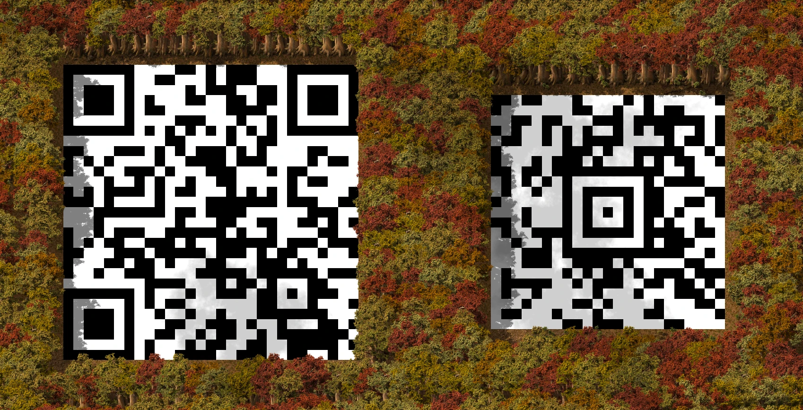

# qrcode-blueprint

_Mod Portal Link_: https://mods.factorio.com/mod/qrcode-blueprint

A Factorio mod to create and scan QR and Aztec code blueprints. 

Useful for sharing links or other data directly on the map.

## How to use

### Generating codes
1. Click the QR code shortcut button in your shortcut bar, or press `Ctrl + Alt + Q`.
2. Type your text.
3. Choose your foreground and (optional) background items (must be the same size).
4. (Optional) Choose a pixel scale (e.g. 2x2).
5. (Optional) Choose the code type (QR Code or Aztec Code).
6. Click Generate and place the blueprint.

### Scanning in-game

You can scan via the map view using a real-world phone scanner. *Very rarely* can external code scanners (like your phone camera) scan vanilla tiles themselves, but the map view is much clearer.

Otherwise, you can use the built in tile scanner to scan all correct codes:

1. Click Scan Map in the GUI to get the Decoder selection tool.
2. Drag the selection box over any physical QR or Aztec code (remote view is supported).
3. The decoded text will display in a popup.

## Recommended Mods

* [Technicolor Lab Tiles](https://mods.factorio.com/mod/tech-tiles) for high-contrast QR codes that are scannable as tiles from external code scanners.  

## Attribution

* `scripts/qrencode.lua` - Pure Lua QR encoder from https://github.com/speedata/luaqrcode
* `thumbnail.png` - Mitya Ivanov, Unsplash. 2019.